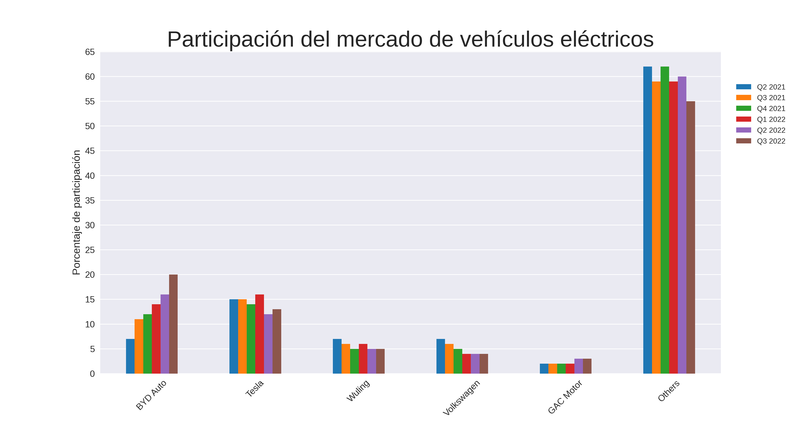

# **Cuota del mercado de vehículos eléctricos (EV)**
Este repositorio muestra el análisis realizado a los datos de "Global Electric Vehicle Market Share" (Cuota de mercado global de vehículos eléctricos), los datos fueron obtenidos de [Makeover Monday](https://data.world/makeovermonday/2023w7).

## Gráfico

De los datos analizados se puede observar que BYD Auto es la única marca de vehículos eléctricos que ha tenido un constante crecimiento desde el Q2 de 2021, Tesla tiene una importante participación del mercado pero en el año 2022 perdió su liderazgo frente a BYD Auto.
